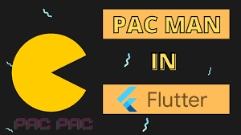
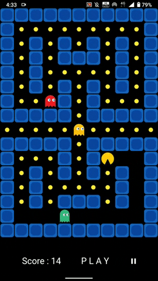
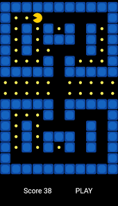

# Pacman Game using Flutter
A fun and interactive implementation of the classic Pacman game built with Flutter. This project aims to recreate the gameplay and visual elements of the iconic Pacman arcade game using the power of Flutter, an open-source UI software development kit created by Google.

Pacman Gameplay


## Features
 - Faithful recreation of the original Pacman gameplay.
 - Gesture Detectors for easy navigation.
 - Score tracking
 - Responsive design to support multiple screen sizes.

## Installation
1. Ensure you have [Flutter](https://docs.flutter.dev/) installed and set up on your machine.
2.  Clone this repository to your local machine using:
```
git clone https://github.com/shreeramkedlaya/pacman.git
```
3. Navigate to the project directory:
 ```
 cd pacman-flutter
 ```
4. Fetch the dependencies:
```
flutter pub get
```

## Usage
Connect your device or use an emulator, then run the app using the following command:
``````
flutter run
``````
## Screenshots





## Contributing

Contributions are welcome! If you find any bugs or want to add new features, please follow these steps:

 - Fork the repository.
 - Create your branch: git checkout -b feature/your-feature.
 - Commit your changes: git commit -m 'Add some feature'.
 - Push to the branch: git push origin feature/your-feature.
 - Submit a pull request.
## Credits

The original Pacman game was created by Namco and released in 1980. This project is entirely recreated using Flutter.
## Disclaimer
This project is intended for educational purposes only and is not affiliated with or endorsed by Namco or any other related entities.

### Enjoy the game!